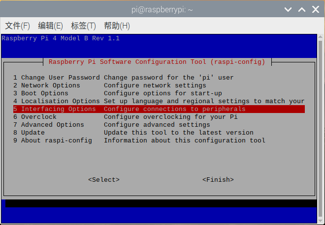
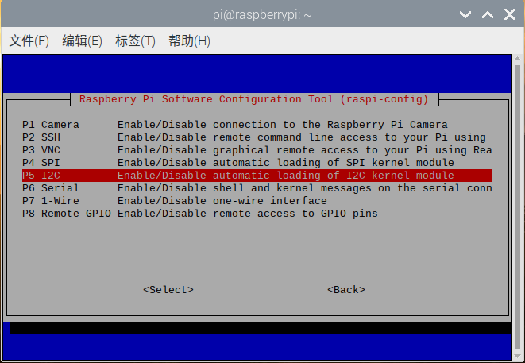
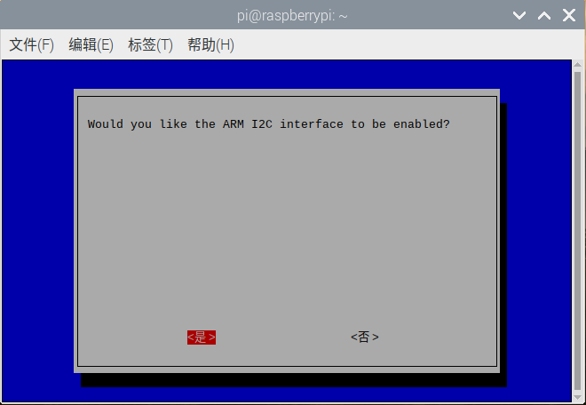
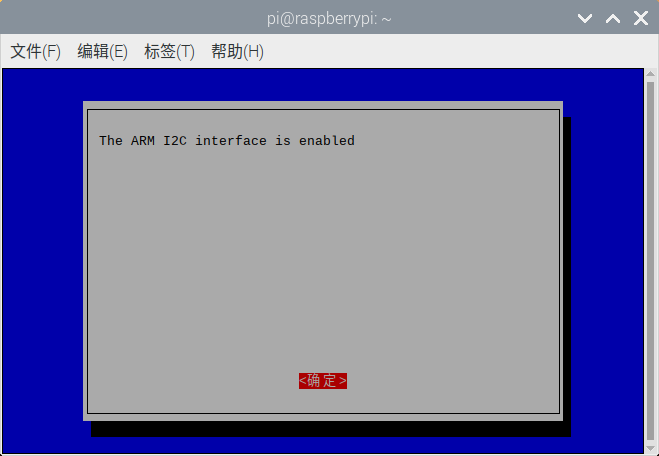
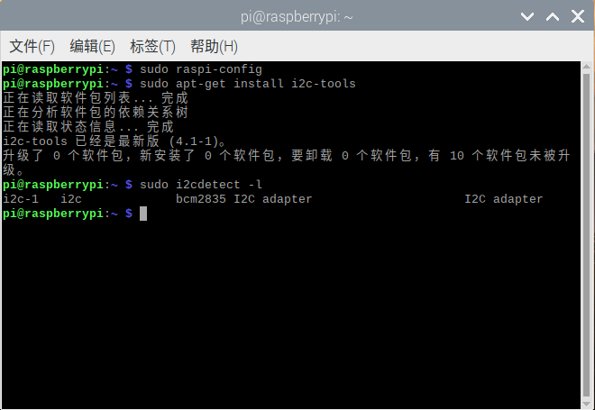
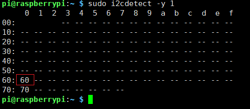
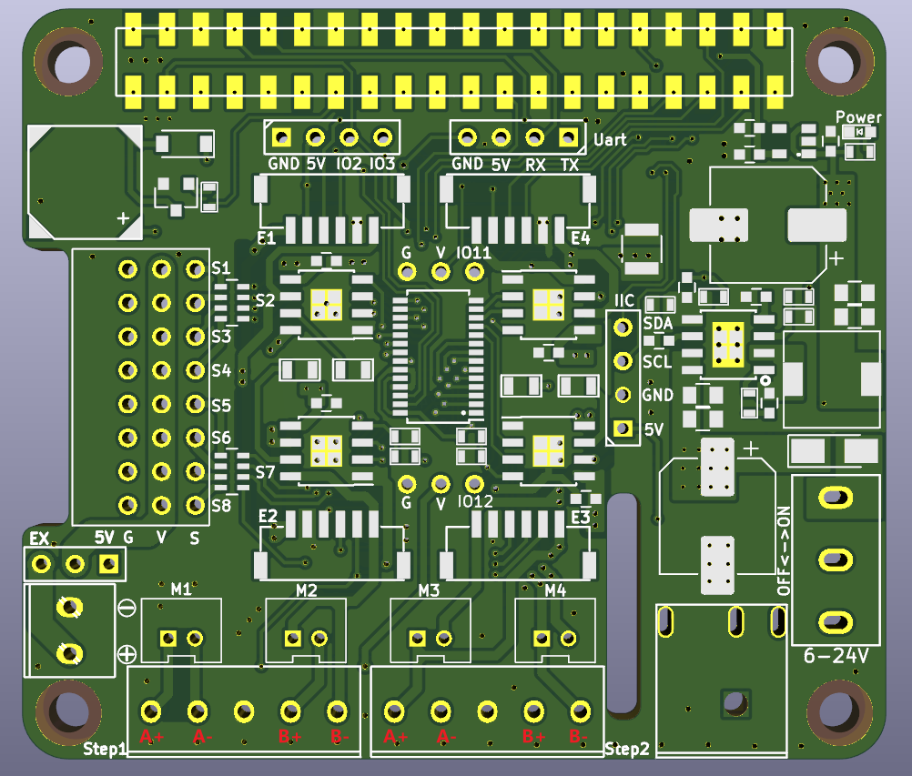

# RaspberryPi Motor Driver Board


RaspberryPi 多功能电机驱动扩展板由[深圳市易创空间科技有限公司](http://www.emakefun.com)出品的一款全功能的机器人电机驱动扩展版，目前已经升级到**V4.0**（[**V3.0老版本资料查看**](https://github.com/emakefun/RaspberryPi-MotorDriverBoard/tree/V3.0) ） 本电机驱动板适用于Raspberry Pi Zero/Zero W/Zero WH/A+/B+/2B/3B/3B+/4B。能够同时支持多路电机/步进电机/舵机/编码电机(Stepper/Motor/Servo/Encoder)，空出摄像头和DIP显示屏排线接口，并且可以多板层叠使用扩展出更多的控制接口，特别适合玩家DIY机器人,智能小车,机械手臂,智能云台等各种应用。


## 原理图

#### 由于我们驱动板是使用I2C控制PCA9685芯片输出16路PWM，所有驱动直流电机或者舵机，不存在所谓的树莓派IO口和控制电机对应关系。
详情可以看 [树莓派驱动板电路原理图](./schematic/RaspBerryDriverBoardV4.0.pdf)
还可以查看驱动板正反面的丝印标注。

## 特点

- 5.5 ~ 2.1mmDC头 供电电压6 ~ 25V，内置DC-DC稳压电路，为Raspberry Pi供电3A以上 (建议使用7.4V航模电池)
- 驱动板IIC地址为0x60，地址可以由背面6个电阻配置地址A0~A5
- 12位分辨率，可调PWM频率高达1.6KHz，可配置的推挽或开漏输出
- 支持同时驱动8路舵，3Pin(黑红蓝GVS)标准接口接线，方便连接舵机，舵机电源可通过跳线帽切换到外部独立供电
- 支持4路6~24V直流电机，PH2.0接口或者3.5mm接线柱，电机单路输出高达电流3A 
- 支持同时驱动2路4线步进电机
- 板载无源蜂鸣器
- 主板预留2个IIC扩展接口，1个串口接口

## 安装I2C库并使能

在使用驱动板之前，必须要先安装I2C库并使能。
打开树莓派终端输入"sudo raspi-config"命令，然后按照下图顺序依次操作即可。









以上就是开启树莓派I2C，接下来我们安装树莓I2C库在终端输入“sudo apt-get install i2c-tools”，输入完成后就可以看到正在下载I2C库，安装完成之后可以在终端输入“sudo i2cdetect -l”检测是否安装正确，若出现类似于下面的信息就说明安装正常。



在终端输入“sudo i2cdetect -y 1”命令即可扫描接在I2C总线上的所有I2C设备，并打印出该设备的I2C总线地址，且我们的扩展板的I2C地址为0x60，如下图。
另外用i2cdetect检测出还有一个0x70地址一直存在，这是一个通用地址，可以给所有从机下达指令


重新启动树莓派，使新的设置生效:

sudo reboot

## 功能介绍

### 驱动舵机

#### C++代码

``` C++
#include "Emakefun_MotorShield.h"

int main() {
  Emakefun_MotorShield Pwm = Emakefun_MotorShield();
  Pwm.begin(50);

  // demo这里只操作舵机1, 其他舵机操作相同
  Emakefun_Servo *myServo1 = Pwm.getServo(1);

  // 速度值是 1 ~ 10 的正整数, 数值越大速度越快
  int speed = 9;
  while (true) {
    // demo这里只操作舵机1, 其他舵机操作相同
    myServo1->writeServo(0, speed);
    delay(2000);
    myServo1->writeServo(90, speed);
    delay(2000);
    myServo1->writeServo(180, speed);
    delay(2000);
  }
}
```

#### Python代码

``` Python
#!/usr/bin/python

from Emakefun_MotorHAT import Emakefun_MotorHAT, Emakefun_Servo
import time
mh = Emakefun_MotorHAT(addr=0x60)

myServo = mh.getServo(1)

# 速度值是 1 ~ 10 的正整数, 数值越大速度越快
speed = 9
while (True):
    # demo这里只操作舵机1, 其他舵机操作相同
    myServo.writeServoWithSpeed(0, speed)
    time.sleep(1)

    myServo.writeServoWithSpeed(90, speed)
    time.sleep(1)

    myServo.writeServoWithSpeed(180, speed)
    time.sleep(1)
```

### 驱动直流电机

#### C++代码

```C++
#include "Emakefun_MotorShield.h"

int main() {
  Emakefun_MotorShield Pwm = Emakefun_MotorShield();
  Pwm.begin(50);
  Emakefun_DCMotor *DCmotor1 = Pwm.getMotor(1);
  Emakefun_DCMotor *DCmotor2 = Pwm.getMotor(2);
  Emakefun_DCMotor *DCmotor3 = Pwm.getMotor(3);
  Emakefun_DCMotor *DCmotor4 = Pwm.getMotor(4);

  DCmotor1->setSpeed(255);
  DCmotor2->setSpeed(255);
  DCmotor3->setSpeed(255);
  DCmotor4->setSpeed(255);

  while (1) {
    DCmotor1->run(FORWARD);
    DCmotor2->run(FORWARD);
    DCmotor3->run(FORWARD);
    DCmotor4->run(FORWARD);
    delay(1000);
    DCmotor1->run(BACKWARD);
    DCmotor2->run(BACKWARD);
    DCmotor3->run(BACKWARD);
    DCmotor4->run(BACKWARD);
    delay(1000);
  }
}
```
#### Python代码

``` Python
#!/usr/bin/python
from Emakefun_MotorHAT import Emakefun_MotorHAT, Emakefun_DCMotor, Emakefun_Servo

import time
import atexit

# create a default object, no changes to I2C address or frequency
mh = Emakefun_MotorHAT(addr=0x60)

# recommended for auto-disabling motors on shutdown!
def turnOffMotors():
 mh.getMotor(1).run(Emakefun_MotorHAT.RELEASE)
 mh.getMotor(2).run(Emakefun_MotorHAT.RELEASE)
 mh.getMotor(3).run(Emakefun_MotorHAT.RELEASE)
 mh.getMotor(4).run(Emakefun_MotorHAT.RELEASE)

atexit.register(turnOffMotors)

################################# DC motor test!
myMotor = mh.getMotor(4)

# set the speed to start, from 0 (off) to 255 (max speed)
myMotor.setSpeed(150)
myMotor.run(Emakefun_MotorHAT.FORWARD);
# turn on motor
myMotor.run(Emakefun_MotorHAT.RELEASE);


while (True):
 print ("Forward! ")

 print ("\tSpeed up...")
 for i in range(255):
  myMotor.setSpeed(i)
  myMotor.run(Emakefun_MotorHAT.FORWARD)
  time.sleep(0.01)

 print ("\tSlow down...")
 for i in reversed(range(255)):
  myMotor.setSpeed(i)
  myMotor.run(Emakefun_MotorHAT.FORWARD)
  time.sleep(0.01)

 print ("Backward! ")
    
 print ("\tSpeed up...")
 for i in range(255):
  myMotor.setSpeed(i)
  myMotor.run(Emakefun_MotorHAT.BACKWARD)
  time.sleep(0.01)

 print ("\tSlow down...")
 for i in reversed(range(255)):
  myMotor.setSpeed(i)
  myMotor.run(Emakefun_MotorHAT.BACKWARD)
  time.sleep(0.01)

 print ("Release")
 myMotor.run(Emakefun_MotorHAT.RELEASE)
 time.sleep(1.0)
```


### 驱动步进电机

本驱动板只支持42步进电机，接线方法如下：



 步进电机要驱动顺畅不卡顿，必须将树莓派I2C速度设置为400K，具体操作步骤如下，

- 打开终端并编辑配置文件(需要root权限) **/boot/config.txt**

- 找到以下行：

  ```
  #dtparam=i2c_arm=on
  ```

- 将其取消注释并将其更改为：

  ```
  dtparam=i2c_arm=on,i2c_arm_baudrate=400000
  ```

- 保存文件并重新启动树莓派

#### C++代码

``` c++
#include "Emakefun_MotorShield.h"

int main () {
 Emakefun_MotorShield Pwm = Emakefun_MotorShield();
 Pwm.begin(50);
 Emakefun_StepperMotor *StepperMotor1 = Pwm.getStepper(200, 1);

 while(1) {
  StepperMotor1->setSpeed(30);
  StepperMotor1->step(100, BACKWARD,SINGLE);
 }
}
```
#### Python代码

``` python
#!/usr/bin/python
#import Raspi_MotorHAT, Raspi_DCMotor, Raspi_Stepper 
from Emakefun_MotorHAT import Emakefun_MotorHAT, Emakefun_DCMotor, Emakefun_StepperMotor

import time
import atexit

# create a default object, no changes to I2C address or frequency
mh = Emakefun_MotorHAT(0x60)

# recommended for auto-disabling motors on shutdown!
def turnOffMotors():
	mh.getMotor(1).run(Emakefun_MotorHAT.RELEASE)
	mh.getMotor(2).run(Emakefun_MotorHAT.RELEASE)
	mh.getMotor(3).run(Emakefun_MotorHAT.RELEASE)
	mh.getMotor(4).run(Emakefun_MotorHAT.RELEASE)

atexit.register(turnOffMotors)

myStepper = mh.getStepper(200, 1)  	# 200 steps/rev, motor port #1
myStepper.setSpeed(30)  		# 30 RPM

while (True):
	print("Single coil steps")
	myStepper.step(100, Emakefun_MotorHAT.FORWARD,  Emakefun_MotorHAT.SINGLE)
	myStepper.step(100, Emakefun_MotorHAT.BACKWARD, Emakefun_MotorHAT.SINGLE)

	print("Double coil steps")
	myStepper.step(100, Emakefun_MotorHAT.FORWARD,  Emakefun_MotorHAT.DOUBLE)
	myStepper.step(100, Emakefun_MotorHAT.BACKWARD, Emakefun_MotorHAT.DOUBLE)

	print("Interleaved coil steps")
	myStepper.step(100, Emakefun_MotorHAT.FORWARD,  Emakefun_MotorHAT.INTERLEAVE)
	myStepper.step(100, Emakefun_MotorHAT.BACKWARD, Emakefun_MotorHAT.INTERLEAVE)

	print("Microsteps")
	myStepper.step(100, Emakefun_MotorHAT.FORWARD,  Emakefun_MotorHAT.MICROSTEP)
	myStepper.step(100, Emakefun_MotorHAT.BACKWARD, Emakefun_MotorHAT.MICROSTEP)

```


### 注意事项：

1、连接驱动板后，检查树莓派IIC，看是否检测到驱动板地址。[链接](https://blog.csdn.net/qq_15807167/article/details/53435831)

2、执行代码时，需将Github上代码下载到本地执行，上面只是部分示例。[下载连接](https://github.com/emakefun/RaspberryPi-MotorDriveBoard)

3、树莓派用普通锂电池供电可能会出现树莓派重启的问题，建议使用7.4V航模电池。

4、可用该驱动板可以驱动精度不高的42步进电机，驱动高精度步进电机时需接专用步进电机驱动。

5、该驱动板可接编码电机，代码正在更新......


